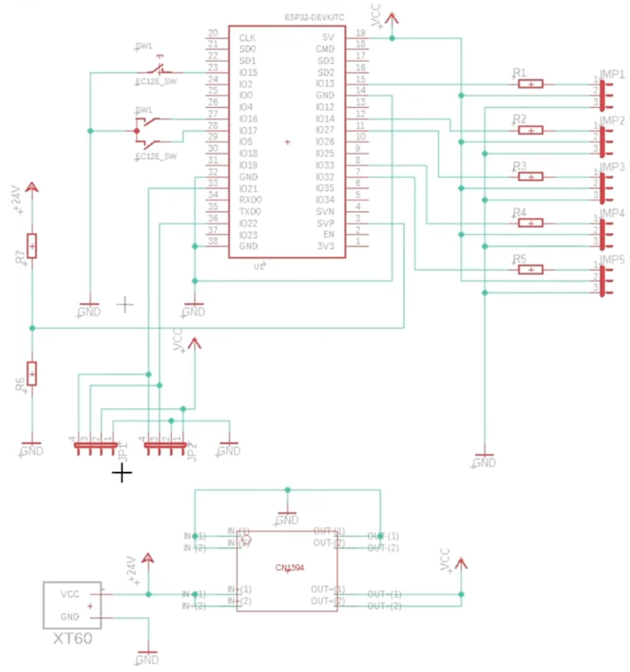
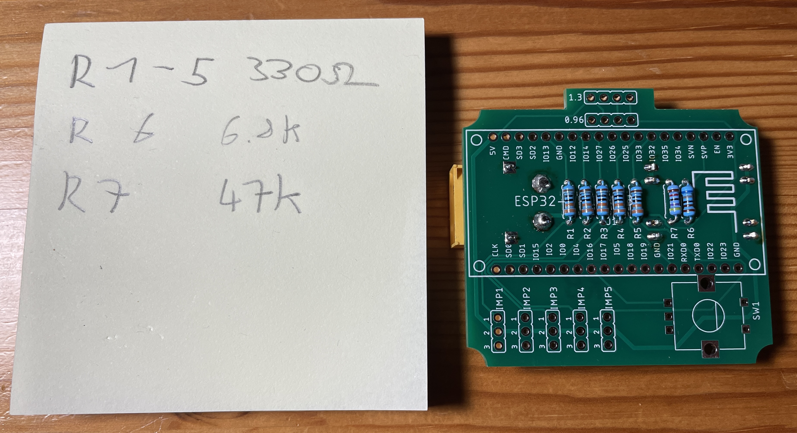
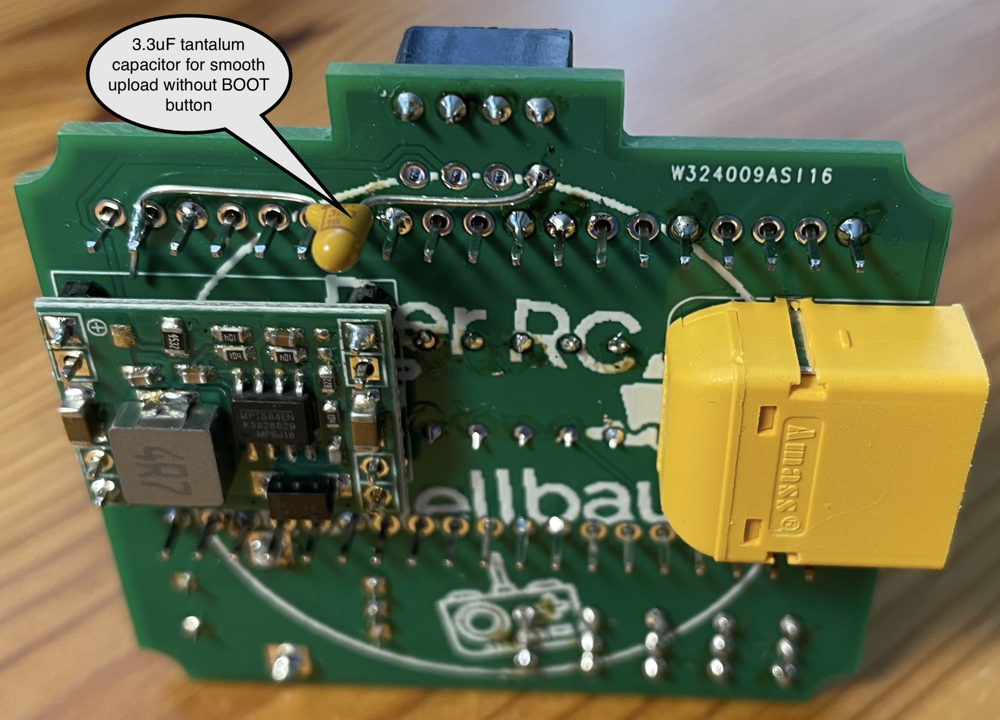

# Servotester_Deluxe (with improved software)

The original autor is "Der RC Modellbauer": https://www.youtube.com/@DerRCModellbauer

forked from his GitHub: https://github.com/Ziege-One/Servotester_Deluxe

PCB, schematic and more details: https://www.pcbway.com/project/shareproject/Servotester_Deluxe_62a3f47c.html

Support thread (in German and English): https://www.rc-modellbau-portal.de/index.php?threads/servotester-deluxe-von-der-rc-modellbauer-mit-meiner-erweiterten-software.17383/

## How to program it
- With Arduino IDE
- With Visual Studio Code (recommended)
- With ESPHome-Flasher (for pre compiled .bin files, depending on your display)

## Schematic

## Menu

## Changelog

## New in v0.12.0:
- Added a Flappy Birds Game
- Alternative logo optimized

## New in v0.11.0:
- Added a Pong game ;-)
- Ball speed is adjustable in settings

## New in v0.10.0:
- Added encoder acceleration in servo tester mode. Makes the operation very handy. If you want to make bigger servo movements, just rotate the encoder faster!
- Unstable Multiswitch issues because of incompatible espressif 32 board solved, see comments in src.ino

## New in v0.9.0:
- Servo is able to oscillate way faster in automatic mode, speed adjustability improved
- Made sure, there is no language string array pointer overflow, if EEPROM was deleted before
- There are still issues with unstable Multiswitch readings. Solution for now: use the pre compiled bin files or use Arduino IDE 2.0.3 with espressif 32 board 2.0.5 (which is unfortunately incompatible with VS Code)

## New in v0.8.0:
- Support for calibrated analogRead, using the ESP32AnalogRead library is improving battery monitoring
- Number of LiPo battery cells is displayed
- Message, if no valid battery is detected
- Support for French language added

## New in v0.7.1:
- ESPHome-Flasher discovered a serious EEMPOM bug, because flash is erased before upload. It should now be fixed.

## New in v0.7.0:
- It is now compatible with VS Code / Platformio. This makes board and library version management way easier, because all is defined in platformio.ini and downloaded automatically. Of course it is still compatible with Arduino IDE
- No external SBUS library required anymore
- Adjustable WiFi power
- Support for alternative logo
- New menu options: 
-- Encoder direction inversed or not
-- SBUS inversed or not
-- Language English or German (others could easily be added)
-- Help text is displayed during start
