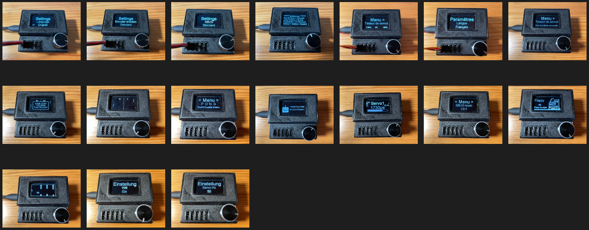

# Servotester_Deluxe (with improved software)

The original autor is "Der RC Modellbauer": https://www.youtube.com/@DerRCModellbauer

forked from his GitHub: https://github.com/Ziege-One/Servotester_Deluxe

PCB, schematic and more details: https://www.pcbway.com/project/shareproject/Servotester_Deluxe_62a3f47c.html

Support thread (in German and English): https://www.rc-modellbau-portal.de/index.php?threads/servotester-deluxe-von-der-rc-modellbauer-mit-meiner-erweiterten-software.17383/

## How to program it
- With Arduino IDE
- With Visual Studio Code (recommended)
- With ESPHome-Flasher (for pre compiled .bin files, depending on your display)

## Schematic

## Menu

## Oscilloscope 0 - 3.3V

## Calculator

## Features
- 5 channel PWM Signal generator for the following modes: STD, NOR, SSR, SUR, SXR
- manual or automatic movement modes
- PWM read function with pulsewidth and frequency display
- PPM, SBUS and IBUS read function
- Oscilloscope for 3.3V RC signals, PWM and PPM signals can be visualized well
- Calculator
- P O N G game
- Flappy Birds game
- Settings menu, parameters are stored in EEPROM
- Operation via rotary encoder with push button
- Supply via USB (for small servos) or XT-60 plug
- 0.96 or 1.3 Inch OLED display
- Some functions can be controlled via the built in website

## TODO Software ****************************************
- make servo center and endpoints flexible
- remove PPM menu delay
- Menu: Add beep on / off & servo stroke, remove servo stuff except frequency
- Add servo output in signal read mode (decoder)

## TODO Hardware ****************************************
- Capacitor for 5V rail
- Capacitor for smooth upload
- Anti backfeed diode with jumper
- Room for buzzer
- Connector for gyro sensor
- Reset button

## ******************************************************

## Changelog

## New in v0.15-beta.2:
- Encoder acceleration enlarged

## New in v0.15-beta.1:
- Battery voltage not actualized during power scale adjustment: bug fixed

## New in v0.15-beta.0:
- EEPROM factory reset option in settings menu
- Servo endpoints and centerpoint are adjustable in 2 groups: STD, NOR, SHR and SSR, SUR, SXR and saved in EEPROM
- Software version is displayed eralier (after logo)
- Sligt oscilloscope optimization

## New in v0.14.0:
- Oscilloscope added
- BUS & oscilloscope input is on CH 5 now
- Precise frequency counter in PWM impulse read mode added
- fixed PWM impulse read bargraph issues
- SSL servo mode removed, because it was useless
- SSR, SUR and SXR frequencies changed, now working with Sanwa PGS-CL II servo
- Added support for active 3V buzzer on GPIO 4
- Calculator: added power of
- ESP32Servo library removed, repaced with native MCPWM ESP32 functionality. Allows way faster servo timings
- A lot of new servo modes added, names are displayed on screen

## New in v0.13.0:
- Servo Hz setting effective on all servo channels and in automatic mode
- Bug fixed: Automatic mode not working in 560 Hz mode
- Bug fixed: Servo angle wrong in 560 Hz mode
- Bug fixed: progress bar out of range in impulse read mode
- Cleaned up frequency selection code
- Microseconds servo range is now displayed in the servo frequency settings menu
- A little calculator was added

## New in v0.12.0:
- Added a Flappy Birds Game
- Alternative logo optimized

## New in v0.11.0:
- Added a Pong game ;-)
- Ball speed is adjustable in settings

## New in v0.10.0:
- Added encoder acceleration in servo tester mode. Makes the operation very handy. If you want to make bigger servo movements, just rotate the encoder faster!
- Unstable Multiswitch issues because of incompatible espressif 32 board solved, see comments in src.ino

## New in v0.9.0:
- Servo is able to oscillate way faster in automatic mode, speed adjustability improved
- Made sure, there is no language string array pointer overflow, if EEPROM was deleted before
- There are still issues with unstable Multiswitch readings. Solution for now: use the pre compiled bin files or use Arduino IDE 2.0.3 with espressif 32 board 2.0.5 (which is unfortunately incompatible with VS Code)

## New in v0.8.0:
- Support for calibrated analogRead, using the ESP32AnalogRead library is improving battery monitoring
- Number of LiPo battery cells is displayed
- Message, if no valid battery is detected
- Support for French language added

## New in v0.7.1:
- ESPHome-Flasher discovered a serious EEMPOM bug, because flash is erased before upload. It should now be fixed.

## New in v0.7.0:
- It is now compatible with VS Code / Platformio. This makes board and library version management way easier, because all is defined in platformio.ini and downloaded automatically. Of course it is still compatible with Arduino IDE
- No external SBUS library required anymore
- Adjustable WiFi power
- Support for alternative logo
- New menu options: 
-- Encoder direction inversed or not
-- SBUS inversed or not
-- Language English or German (others could easily be added)
-- Help text is displayed during start
